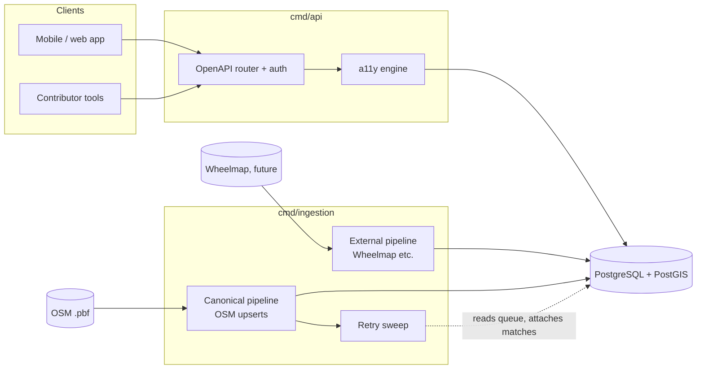
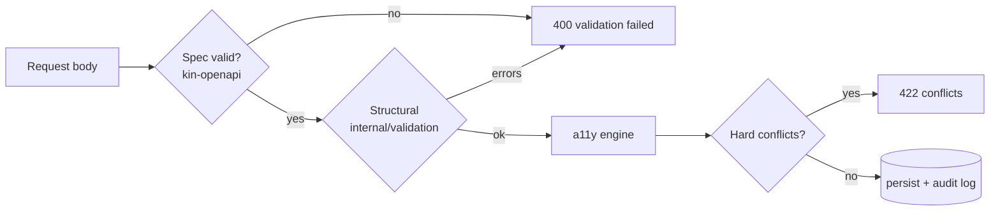

# InWheel API

Public REST API for **InWheel**, a global registry of physical-place accessibility data. This repository contains the API and the batch ingestion service that feeds it from OpenStreetMap and other upstream sources.

The API is a pure data layer. It stores and returns accessibility facts, and never decides whether a place is "accessible" for a given user. Clients apply their own relevance logic per user profile.

Licensed under [AGPL-3.0](./LICENSE).

## Architecture at a glance



Two binaries share a Postgres+PostGIS database and a domain model in `pkg/models`:

| Binary | Role |
|---|---|
| [`cmd/api`](./cmd/api) | REST API. Reads and writes places, accessibility profiles, and API keys. Runs structural validation and the accessibility rule engine on every write. |
| [`cmd/ingestion`](./cmd/ingestion) | Batch CLI. Pulls place data from external sources (OSM today, Wheelmap-style sources next) and writes it into the registry. Reconciles unmatched records via a retry sweep after every canonical ingest. |

For a deeper tour, start at the per-package READMEs linked in the [Repository layout](#repository-layout) section.

## Data model

**`Place`**: a physical location with coordinates, category, OSM metadata, and an optional parent (e.g. a shop inside a mall). External references (Wheelmap, future sources) attach as an `external_ids` JSONB map. See [`pkg/models`](./pkg/models).

**`AccessibilityProfile`**: attached to a place. Contains:
- `overall_status`: `accessible` | `limited` | `inaccessible` | `unknown`
- `components`: array of typed features (`entrance`, `restroom`, `parking`, `elevator`, `other`)

Each component carries its own `overall_status`, raw property values (widths, heights, booleans), and machine-computed `audit_flags` (e.g. `"narrow width (0.8m required)"`). Child places inherit parent components for any type they don't provide themselves, so a shop inside a mall inherits the mall's parking. See [`internal/a11y`](./internal/a11y).

**`ExternalRef`**: confidence-scored attachment of an external source's ID (Wheelmap etc.) to a Place. Produced by the [identity matcher](./internal/identity).

## REST API

All data endpoints are versioned under `/v1`. Probe endpoints (`/healthz`, `/readyz`, `/openapi.yaml`) are unversioned. The OpenAPI spec is served at `GET /openapi.yaml` and embedded in the binary.

| Method | Path | Auth | Description |
|---|---|---|---|
| `POST` | `/v1/keys` | none | Register a new API key (rate limited: 3 per 20 min per IP) |
| `DELETE` | `/v1/keys` | `X-API-Key` | Revoke the calling key |
| `GET` | `/v1/places` | optional | List places with cursor pagination + proximity or bbox filter |
| `GET` | `/v1/places/{id}` | optional | Single place with effective accessibility profile (inherits parent components) |
| `POST` | `/v1/places` | `X-API-Key` | Create a place (optionally with accessibility data in the same call) |
| `PATCH` | `/v1/places/{id}/accessibility` | `X-API-Key` | Replace or create the accessibility profile for a place |
| `GET` | `/healthz` | none | Liveness probe |
| `GET` | `/readyz` | none | Readiness probe (pings the database) |
| `GET` | `/openapi.yaml` | none | Full OpenAPI spec |

### Authentication

Authenticated endpoints expect `X-API-Key: iwk_<hex>` in the request header. Keys are issued via `POST /v1/keys` and stored hashed (SHA-256). A key can be revoked by calling `DELETE /v1/keys` with that key; the row is soft-deleted by setting `revoked_at`. Authenticated calls are rate limited to 60 requests/second per key.

### Write validation

Every write runs through two layers before persistence:



- **Spec validation** at the middleware layer catches type, format, and required-field errors from the OpenAPI spec.
- **Structural validation** ([`internal/validation`](./internal/validation)) catches multi-field business validity: mutually exclusive query params, range checks, UUID format.
- **The a11y engine** ([`internal/a11y`](./internal/a11y)) computes audit flags from component properties, then detects *hard* conflicts. Submitting `overall_status: accessible` while also submitting `has_step: true, has_ramp: false` returns 422. Threshold flags (narrow width, missing braille) are stored but never block.

The API never decides accessibility. It records facts.

### Querying places

`GET /v1/places` supports cursor pagination (`limit` 1-100, opaque `cursor`) and two mutually exclusive spatial filters:

| Filter | Parameters | Notes |
|---|---|---|
| Proximity | `lng`, `lat`, `radius` (metres, max 50 000) | Returns places within the circle |
| Bounding box | `min_lng`, `min_lat`, `max_lng`, `max_lat` | Returns places within the box |

Response shape:

```json
{
  "data": [ /* Place objects */ ],
  "next_cursor": "base64-encoded-cursor"
}
```

`next_cursor` is omitted on the final page.

## Ingestion

`cmd/ingestion` is a one-shot CLI invoked as:

```
inwheel-ingestion <source> <full-import|diff-sync>
```

Today there's one canonical source, `osm`, which streams a `.osm.pbf` file, filters POIs by tag allowlist, and upserts them into the places table. After the import finishes, the [retry sweep](./internal/identity) drains queued external records by re-running the matcher against the freshly-touched places.

The pipeline is built around two source kinds:

- **Canonical sources** own place rows. They emit `models.Place` values that get upserted via the `(osm_id, osm_type)` natural key.
- **External sources** contribute accessibility data and attach their IDs to existing canonical places via the [identity matcher](./internal/identity). Records the matcher cannot place are queued in `unmatched_external`; the next canonical ingest reconsiders them.

See [`cmd/ingestion`](./cmd/ingestion) for the full pipeline diagrams.

## Repository layout

| Path | What's there |
|---|---|
| [`api/`](./api/openapi.yaml) | OpenAPI spec, embedded into both binaries |
| [`cmd/api/`](./cmd/api) | REST API binary: routing, auth, OpenAPI strict server wiring |
| [`cmd/ingestion/`](./cmd/ingestion) | Batch ingestion CLI: canonical and external pipelines, batcher, sweep wiring |
| [`pkg/models/`](./pkg/models) | Domain types shared across binaries |
| [`internal/a11y/`](./internal/a11y) | Accessibility rule engine: audit flag computation, conflict detection, parent inheritance |
| [`internal/api/v1/`](./internal/api/v1) | Code-generated OpenAPI types and strict server interface (do not edit by hand) |
| `internal/audit/` | Append-only write log of "who created/modified what" |
| [`internal/db/`](./internal/db) | GORM connection, migration runner, PostGIS index setup |
| `internal/geo/` | Small spatial query helpers (`ST_DWithin`, `ST_MakeEnvelope`) |
| [`internal/identity/`](./internal/identity) | Identity matcher: decides whether an external record refers to an existing place. Hosts `Resolver` (at-write) and `Sweeper` (retry) |
| `internal/middleware/` | `http.Handler` middleware: request logging, rate limiter, API-key context plumbing |
| `internal/pagination/` | Opaque cursor encode/decode |
| [`internal/place/`](./internal/place) | Repository for the places table: `FindCandidates`, `AttachExternalRef`, `UpsertBatch` |
| [`internal/sources/`](./internal/sources) | Source abstraction (capability interfaces) for ingestion |
| [`internal/sources/osm/`](./internal/sources/osm) | OpenStreetMap source: tag allowlist, transformer, PBF streamer |
| `internal/testhelpers/` | Test container bootstrap for PostgreSQL+PostGIS |
| [`internal/unmatched/`](./internal/unmatched) | Repository for the `unmatched_external` retry queue |
| [`internal/validation/`](./internal/validation) | Structural request validation (pure functions over `pkg/models`) |

## Running

### Docker Compose

```sh
cp .env.example .env   # set DB_USER, DB_PASSWORD, DB_NAME
docker compose up
```

The API will be available at `http://localhost:8080`.

### Environment variables

| Variable | Default | Description |
|---|---|---|
| `PORT` | `8080` | API server port |
| `DB_HOST` | `localhost` | PostgreSQL host |
| `DB_PORT` | `5432` | PostgreSQL port |
| `DB_USER` | `postgres` | Database user |
| `DB_PASSWORD` | `postgres` | Database password |
| `DB_NAME` | `inwheel` | Database name |
| `DB_SSLMODE` | `disable` | PostgreSQL SSL mode |
| `DB_MAX_OPEN_CONNS` | `25` | Connection pool max open |
| `DB_MAX_IDLE_CONNS` | `5` | Connection pool max idle |
| `OSM_PBF_PATH` |  | Path to the `.osm.pbf` file (ingestion only) |

## Development

```sh
go test ./...                                  # unit tests
go test -tags integration -timeout 120s ./...  # integration tests (requires Docker)
go vet ./...                                   # lint
```

Integration tests spin up a real PostgreSQL+PostGIS container via `testcontainers-go`. Docker must be running.

Both binaries auto-apply migrations from [`internal/db/migrations`](./internal/db) at boot.
