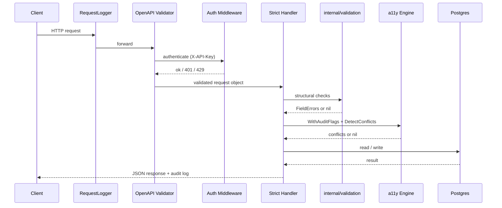

# cmd/api

The `api` binary is the public-facing REST API for InWheel. It listens on port 8080, exposes all data endpoints under `/v1/`, and is the sole writer of places and accessibility profiles. The API is a pure data layer: it stores and returns accessibility facts but never decides whether a place is accessible for a given user profile.

## OpenAPI and code generation

The authoritative API contract lives in `api/openapi.yaml`. The generated stub (`internal/api/v1/server.gen.go`) is produced by oapi-codegen and must not be edited directly. The strict server pattern is used: the generated layer handles HTTP binding and parameter coercion; handlers implement `StrictServerInterface` and work with typed request/response objects rather than raw `http.Request` values.

The spec is embedded via `api/spec.go` and served at `GET /openapi.yaml` so clients can always fetch the version that matches the running binary.

## Endpoint families

| Family | Endpoints |
|---|---|
| Places | `GET /v1/places`, `POST /v1/places`, `GET /v1/places/{id}`, `PATCH /v1/places/{id}/accessibility` |
| API keys | `POST /v1/keys` (register), `DELETE /v1/keys` (revoke) |
| Infrastructure | `GET /healthz`, `GET /readyz`, `GET /openapi.yaml` |

Infra endpoints are registered on a separate outer mux and never pass through the OpenAPI validator or auth middleware.

## Request flow

## Auth model

Authentication is an X-API-Key header. The key is hashed with SHA-256 on arrival; only the hash is stored and compared. The auth function is wired as an oapi-codegen `AuthenticationFunc`, so it runs inside the OpenAPI validator before handlers see the request.

Key lifecycle:
- Registration: `POST /v1/keys` with an email address. Rate-limited to 3 requests per 20 minutes per IP. Returns the raw key once — it is never stored.
- Revocation: `DELETE /v1/keys` using the key itself as auth. Sets `revoked_at`; subsequent lookups exclude revoked rows.
- Per-key request rate limit: 60 requests per second, enforced by a token-bucket limiter keyed on the key hash.

The key ID is injected into the request context after successful auth so downstream handlers and the structured request log can reference it without an additional DB lookup.

## Validation layers

Two distinct layers handle different classes of invalid input:

1. **OpenAPI middleware** (kin-openapi / nethttp-middleware) — catches spec-level errors: missing required fields, wrong types, enum violations, UUID format. Runs at the edge before handlers.
2. **`internal/validation`** — catches constraints the spec cannot express: whitespace-only names, mutually exclusive query-param groups (proximity vs bounding box), cursor decode failures, tag/metadata size limits. Runs inside the handler, after the spec validator.
3. **`internal/a11y`** — catches business rule violations: a component is marked `accessible` but the submitted properties directly contradict that claim. Returns HTTP 422 with a list of conflicts.

All three layers produce the same JSON error shape — `{error, fields[]}` for 400, `{error, conflicts[]}` for 422 — via a shared `validationErrorHandler`.

## Other details

- Body size is capped at 1 MiB via `http.MaxBytesReader` applied as a middleware on the v1 mux.
- Graceful shutdown: SIGINT/SIGTERM triggers a 30-second drain window.
- Structured JSON logging via `log/slog` at DEBUG level by default; the request logger middleware records method, path, status, duration, and API key ID.
- Cursor-based pagination for `GET /v1/places` ordered by `(updated_at DESC, id ASC)`; the cursor encodes both fields opaquely.
- `GET /v1/places/{id}` computes the effective accessibility profile on read: if the place has a `parent_id`, parent components are merged in for any type the child doesn't own (see `internal/a11y`).
