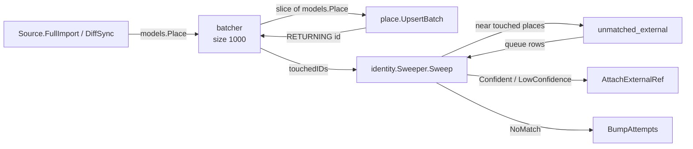
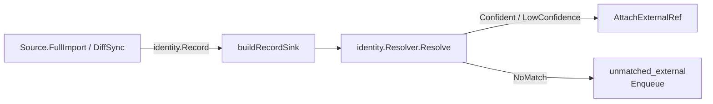

# cmd/ingestion

Standalone batch binary (`inwheel-ingestion <source> <full-import|diff-sync>`) that pulls place data from external sources and writes it into the places table. It has two mutually exclusive pipelines — canonical and external — chosen at runtime based on the source's declared `SourceKind`. Running it is idempotent: the same input produces the same database state.

## Configuration

All configuration comes from environment variables.

| Variable | Default | Notes |
|---|---|---|
| `OSM_PBF_PATH` | — | Required. Path to the `.osm.pbf` file. |
| `DB_HOST` | `localhost` | |
| `DB_PORT` | `5432` | |
| `DB_USER` | `postgres` | |
| `DB_PASSWORD` | `postgres` | |
| `DB_NAME` | `inwheel` | |
| `DB_SSLMODE` | `disable` | |

## Canonical pipeline (OSM)

Canonical sources own the place rows. The source streams `models.Place` values one at a time; the batcher accumulates them and flushes in batches of 1000 via `place.UpsertBatch`. After the last flush, the batcher has a complete list of `touchedIDs` — the database-assigned UUIDs of every place written in this run — which the Sweeper uses to retry previously unmatched external records.

Sweep failure is logged as a warning but does not fail the run — the place rows are already written. Per-run telemetry includes `written`, `sweep_considered`, `sweep_confident`, `sweep_low_confidence`, `sweep_no_match`, and `sweep_errors`.

## External pipeline (Wheelmap and future sources)

External sources contribute accessibility data attached to existing canonical places. The source streams `identity.Record` values; `buildRecordSink` passes each to `identity.Resolver`, which runs `Match` and either attaches an external reference to the matched place or enqueues the record in `unmatched_external` for a future sweep.

Per-record errors are logged but do not abort the run. Per-run telemetry: `confident`, `low_confidence`, `no_match`, `errors`.

## Dispatch model

`runPipeline` switches on `src.Kind()`. From there, `dispatchCanonical` and `dispatchExternal` type-assert the source to the appropriate capability interface:

| Kind | Command | Interface required |
|---|---|---|
| Canonical | `full-import` | `sources.FullImporter` |
| Canonical | `diff-sync` | `sources.DiffSyncer` |
| External | `full-import` | `sources.ExternalFullImporter` |
| External | `diff-sync` | `sources.ExternalDiffSyncer` |

A source need only implement the commands it supports. The binary returns a clear error if the command is requested but the interface is absent.

## Source registry

`buildSource` in `registry.go` maps a source name string to a concrete `sources.Source`. Currently only `"osm"` is registered. Adding a new source is two steps: a new `case` in `buildSource` and a new package under `internal/sources/<name>/`.

## The batcher

`batcher` is a simple, single-goroutine accumulator. It collects places, flushes when the buffer reaches `size`, and accumulates `touchedIDs` from the `RETURNING id` values that `UpsertBatch` back-populates on the slice. `flushNow` is called explicitly after the source finishes to drain the final partial batch.
