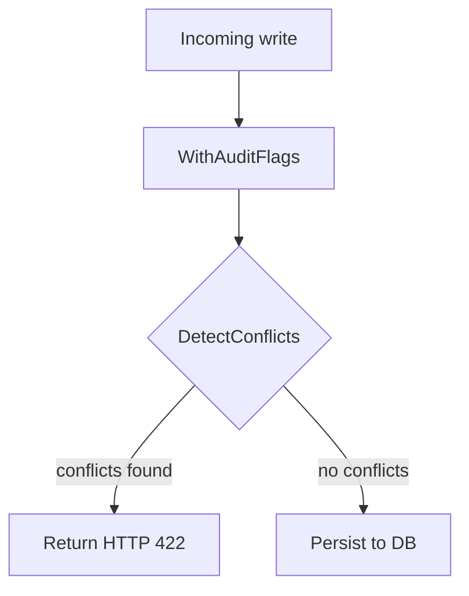
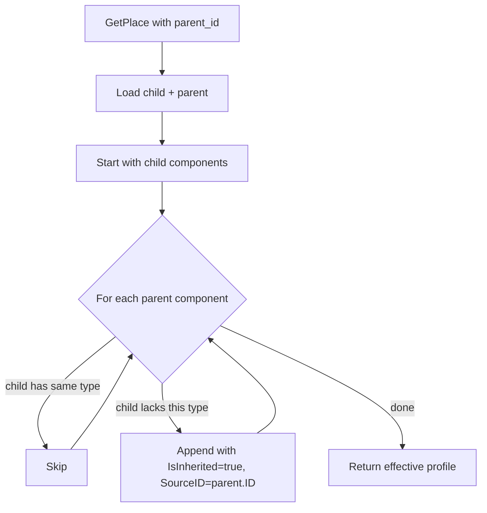

# internal/a11y

Pure rule engine that runs synchronously on every write touching an `AccessibilityProfile`. Two responsibilities: populating `AuditFlags` on each component from the submitted property values (`WithAuditFlags`), and detecting hard self-contradictions between a component's submitted `OverallStatus` and those flags (`DetectConflicts`). A third function, `ComputeEffectiveProfile`, handles read-time inheritance of parent components.

`Engine` is a zero-field struct. All methods are pure functions over `pkg/models` types: no DB access, no state.

## Core principles

1. **Data fidelity.** The API stores what is submitted. It does not compute whether a place is accessible — that judgement belongs to the client, which knows the user's specific needs.
2. **Facts over opinions.** `AuditFlags` are objective facts derived from the submitter's own property values (e.g. entrance width < 0.8m is a measurable fact). They are stored for clients to use, not for the server to act on.
3. **Specific overrides general.** A child place's own component data always takes precedence over the parent's equivalent component.
4. **Self-contradictions are rejected at write time.** Data that directly contradicts itself (e.g. a component marked `accessible` while the submitter described a physical barrier with no workaround) is rejected with HTTP 422. Everything else is accepted.

## AuditFlags

`WithAuditFlags` resets and recomputes `AuditFlags` on every component on every write. The flags are deterministic derivations of what the submitter themselves provided:

| Component | Flag | Condition |
|---|---|---|
| Entrance | `narrow width (0.8m required)` | `width < 0.8m` |
| Entrance | `contains step` | `has_step = true` |
| Entrance | `high step (>0.05m)` | `has_step = true` and `step_height > 0.05m` |
| Entrance | `step with no ramp` | `has_step = true` and `has_ramp = false` |
| Restroom | `not wheelchair accessible` | `wheelchair_accessible = false` |
| Restroom | `narrow door (0.8m required)` | `door_width < 0.8m` |
| Restroom | `missing grab rails` | `grab_rails = false` |
| Elevator | `small cabin width (0.8m required)` | `width < 0.8m` |
| Elevator | `small cabin depth (1.1m required)` | `depth < 1.1m` |
| Elevator | `missing braille` | `braille = false` |
| Elevator | `missing audio` | `audio = false` |
| Parking | `no disabled spaces` | `has_disabled_spaces = false` |

The engine never concludes that a place is inaccessible. Clients receive the flags and apply their own relevance logic per user profile.

## Write flow



`DetectConflicts` blocks a write only when one of three hard-contradiction flags is set on a component that the submitter also marked `accessible`. These are cases where the submitter's own data directly contradicts their own status:

| Flag | Why it's a hard contradiction |
|---|---|
| `step with no ramp` | The submitter described a physical barrier with no workaround, then marked the component accessible |
| `not wheelchair accessible` | The submitter explicitly stated it is not wheelchair accessible, then marked it accessible |
| `no disabled spaces` | The submitter explicitly stated there are no disabled spaces, then marked parking accessible |

All other flags (narrow width, high step, missing braille, missing grab rails, etc.) are based on measurement thresholds derived from accessibility standards. They are stored as facts for clients to interpret. A place with a 0.75m entrance can still be marked `accessible`. Whether that matters depends on the user's wheelchair width, which the server does not know.

A 422 response includes the list of conflicts:

```json
{
  "error": "accessibility data contains conflicts",
  "conflicts": [
    { "component": "entrance", "reason": "status is accessible but: step with no ramp" }
  ]
}
```

## Parent inheritance: ComputeEffectiveProfile

InWheel supports a shallow parent-child relationship, used for cases like a mall containing shops or an airport containing gates. When querying a child place, the system computes an **effective profile** by merging the child's own components with the parent's. The child inherits any component type the parent has that the child does not provide itself.



Inherited components are marked `is_inherited: true` and carry the parent's `source_id`. They are not written back to the DB: `IsInherited` and `SourceID` exist only in the response.

### Child overrides parent

If a child provides its own data for a component type, the parent's data for that same type is ignored entirely for that child's view. There is no partial merging within a component.

Example: a mall has an `accessible` entrance; a shop inside has its own `inaccessible` entrance. The shop's effective profile shows only its own `inaccessible` entrance.

### No bottom-up propagation

A child's data never modifies the parent's record. Each place is its own source of truth.

## What this engine does not do

- It does not compute a general accessibility rating for a place.
- It does not decide whether a set of flags makes a place inaccessible.
- It does not modify `overall_status` based on component data.

These decisions belong to client applications, which can filter and rank places based on the specific accessibility needs of their users.
