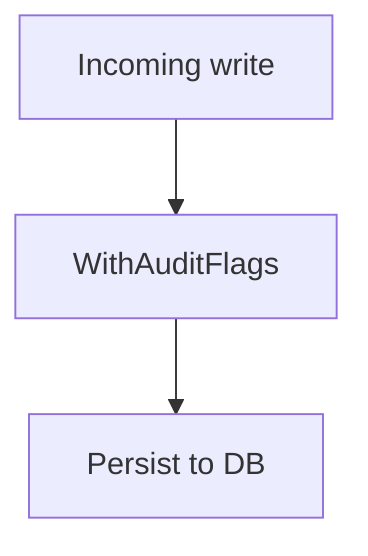
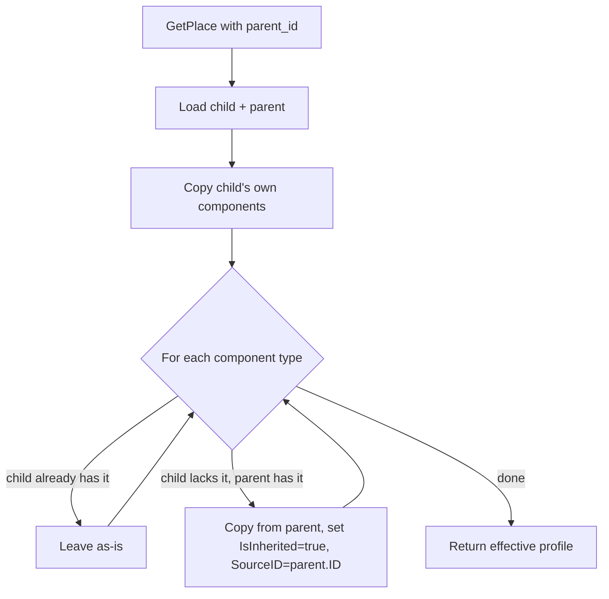

# internal/a11y

Pure rule engine that runs synchronously on every write touching an `AccessibilityProfile`. Two responsibilities: populating `AuditFlags` on each non-nil component from its submitted property values (`WithAuditFlags`), and computing an effective profile that inherits parent components at read time (`ComputeEffectiveProfile`).

`Engine` is a zero-field struct. All methods are pure functions over `pkg/models` types: no DB access, no state.

## Core principles

1. **Data fidelity.** The API stores what is submitted. It does not compute whether a place is accessible — that judgement belongs to the client, which knows the user's specific needs.
2. **Facts over opinions.** `AuditFlags` are objective facts derived from the submitter's own property values (e.g. entrance width < 0.8m is a measurable fact). They are stored for clients to use, not for the server to act on.
3. **Specific overrides general.** A child place's own component data always takes precedence over the parent's equivalent component.
4. **No write is ever rejected on accessibility grounds.** There is no conflict detection and no 422 response from this package. Audit flags are informational only.

## AuditFlags

`WithAuditFlags` recomputes `AuditFlags` on every non-nil component on every write. The flags are deterministic derivations of what the submitter themselves provided:

| Component | Flag | Condition |
|---|---|---|
| Entrance | `narrow width (0.8m required)` | `width < 0.8m` |
| Entrance | `no level route (no ramp and not level)` | `is_level = false` and neither `has_fixed_ramp` nor `has_removable_ramp` is true |
| Pathways | `narrow pathway (0.9m required)` | `width < 0.9m` |
| Restroom | `narrow door (0.8m required)` | `door_width < 0.8m` |
| Restroom | `small turning radius (1.5m required)` | `turning_radius < 1.5m` |
| Restroom | `missing grab rails` | `has_grab_rails = false` |
| Parking | `no disabled spaces` | `has_disabled_spaces = false` |
| Elevator | `small cabin width (0.8m required)` | `width < 0.8m` |
| Elevator | `small cabin depth (1.1m required)` | `depth < 1.1m` |
| Elevator | `narrow door (0.8m required)` | `door_width < 0.8m` |
| Elevator | `missing braille` | `has_braille = false` |
| Elevator | `missing audio` | `has_audio = false` |

A field left `nil` means "unknown" and never triggers a flag — flags only fire on an explicit value that fails the threshold. The engine never concludes that a place is inaccessible; clients receive the flags and apply their own relevance logic per user profile.

## Write flow

```mermaid
flowchart TD
    A[Incoming write] --> B[WithAuditFlags]
    B --> C[Persist to DB]
```

There is no rejection branch. Every structurally valid write persists; `internal/validation` is the only layer that can reject a request before it reaches this engine.

## Parent inheritance: ComputeEffectiveProfile

InWheel supports a shallow parent-child relationship, used for cases like a mall containing shops or an airport containing gates. When querying a child place, the system computes an **effective profile** by merging the child's own components with the parent's. The child inherits any component (`Entrance`, `Pathways`, `Restroom`, `Parking`, `Elevator`) the parent has that the child does not provide itself.

```mermaid
flowchart TD
    A[GetPlace with parent_id] --> B[Load child + parent]
    B --> C[Copy child's own components]
    C --> D{For each component type}
    D -- child already has it --> E[Leave as-is]
    D -- child lacks it, parent has it --> F[Copy from parent, set IsInherited=true, SourceID=parent.ID]
    F --> D
    E --> D
    D -- done --> G[Return effective profile]
```

Inherited components are marked `is_inherited: true` and carry the parent's `source_id`. They are not written back to the DB: `IsInherited` and `SourceID` exist only in the response, computed fresh on every read. `SourceReports` and `UserVerified` are copied from the child only — they are not subject to inheritance.

### Child overrides parent

If a child provides its own data for a component, the parent's data for that same component is ignored entirely for that child's view. There is no partial merging within a component — it's all-or-nothing per component.

Example: a mall has parking data; a shop inside it does not. The shop's effective profile shows the mall's parking, marked `is_inherited: true`. If the shop also has its own entrance data, that entrance is used as-is, un-inherited.

### No bottom-up propagation

A child's data never modifies the parent's record. Each place is its own source of truth.

## What this engine does not do

- It does not compute a general accessibility rating for a place.
- It does not decide whether a set of flags makes a place inaccessible.
- It does not detect or reject conflicting data — everything structurally valid is accepted and stored as submitted.

These decisions belong to client applications, which can filter and rank places based on the specific accessibility needs of their users.
