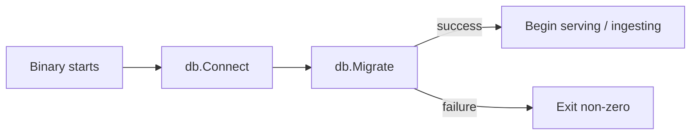

# internal/db

Database connection and migration runner shared by `cmd/api` and `cmd/ingestion`. The package is intentionally thin: it opens a GORM connection over the pgx driver, applies any pending SQL migrations from a numbered series, and ensures the PostGIS spatial indexes the application relies on exist. No queries, no models — those live in their owning packages.

## Stack

| Layer | Choice |
|---|---|
| Database | PostgreSQL 16+ with the PostGIS extension |
| Driver | `pgx/v5` via GORM's `postgres` dialector |
| ORM | GORM v2, used for query building and connection pooling. Schema migrations are raw SQL, not `AutoMigrate`. |

PostGIS is required: the `places` table stores lat/lng for application use, and the `unmatched_external` table stores a `geography(POINT, 4326)` column with a GIST index used by the retry sweep's spatial join.

## Connection

`Connect(Config)` returns a `*gorm.DB`. The `Config` struct collects host, port, credentials, database name, SSL mode, and pool tuning (`MaxOpenConns`, `MaxIdleConns`). Both binaries read those values from environment variables — see the root [README](../../README.md) for the full list.

## Migrations

Migration files live under `internal/db/migrations/` as numbered pairs:

```
000001_create_places.up.sql
000001_create_places.down.sql
000002_create_accessibility_profiles.up.sql
…
```

`Migrate(*gorm.DB)` is called at the boot of both binaries. It tracks applied versions in a metadata table and runs anything new, in numerical order. Down migrations exist for completeness but are not invoked by the runtime — they are only used in tests and manual rollback.

### Conventions

- One logical change per migration. Don't pile schema and data changes together.
- Add the down migration alongside the up migration in the same commit.
- Names start with a numeric prefix `000NNN_` and a snake-case verb-phrase.
- New PostGIS indexes go in the same migration as the column they index.

### Pre-production caveat

We are pre-prod. Until GA we sometimes edit migrations in place rather than always adding a new one — when the only consumers of an unreleased migration are CI, local dev, and ephemeral preview environments, an edit costs less than a new file. Production deployment will switch to strict immutability.

## Boot sequence



If `Migrate` fails, both binaries log and exit. The API never starts serving with a partially migrated schema.
