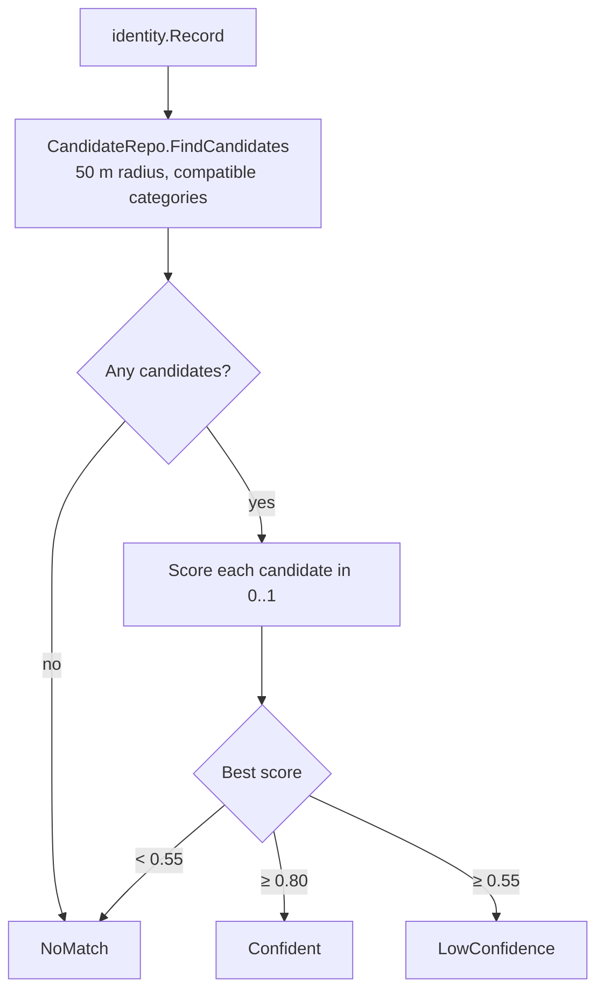
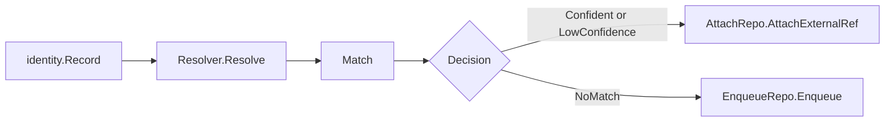
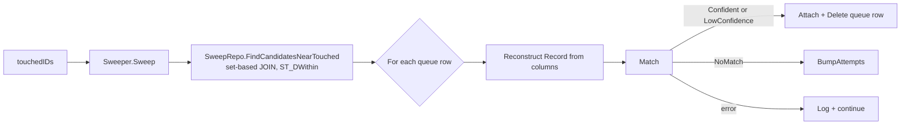

# internal/identity

Decides whether an incoming non-OSM record refers to an existing place in the registry, or whether no acceptable match exists. The package is the matching brain shared by the at-write path (`Resolver`, used during external-source ingestion) and the retry path (`Sweeper`, used at the tail of every canonical ingest). It does no I/O of its own — callers wire in repositories that implement small, focused interfaces.

## The algorithm

### Candidate fetch

`CandidateRepo.FindCandidates` returns active places within `RadiusM` (50 m) whose category is in the compatible set for the incoming record's category. Compatibility is an allowlist:

| Record category | Matches against |
|---|---|
| `cafe` / `restaurant` / `bar` | each other (food-service cluster) |
| `shop` | `shop` only |
| `healthcare` | `healthcare` only |
| anything else | itself only |

A cafe will never match a pharmacy. This hard filter eliminates the worst class of wrong match cheaply.

### Scoring

Each candidate gets a score in `[0, 1]` from three weighted components:

| Component | Weight | Computation |
|---|---|---|
| Distance | 0.5 | Linear falloff: 1.0 at 0 m, 0.0 at `RadiusM` (haversine) |
| Name | 0.4 | Token-set Jaccard over `Normalize`d strings (lowercase, ASCII fold, punctuation strip, dedup tokens) |
| Address | 0.1 | 1.0 if street + housenumber both match, 0.5 if street only, 0.0 if mismatch |

If either side has no street, the address signal is dropped and its 0.1 weight is redistributed proportionally between distance and name. The final score stays in `[0, 1]`.

### Decision

| Best score | Outcome | What callers do |
|---|---|---|
| `≥ 0.80` | `KindConfident` | Attach an `ExternalRef` to the matched place |
| `≥ 0.55` | `KindLowConfidence` | Attach with the lower confidence recorded on the ref |
| `< 0.55` (or no candidates) | `KindNoMatch` | Enqueue the record in `unmatched_external` |

Tuning constants live in `score.go` and are reviewed against fixtures so threshold drift is visible at PR review time.

## Two callers, one matcher

### Resolver (at write time, external pipeline)

Used by `cmd/ingestion` for every record from an external source. Implements attach-or-enqueue:

`Resolver` populates the `UnmatchedExternal` row with the record's full matchable signal (name, category, street, housenumber, lat, lng) — not just the source IDs — so the `Sweeper` can reconstruct a Record later without unmarshalling the upstream payload.

### Sweeper (at tail of canonical ingest)

After every OSM ingest finishes flushing, `runCanonical` hands the IDs of just-touched places to the Sweeper. It re-runs Match against every queue row near those places — those are the candidates whose chances just improved.

Per-row errors are non-fatal: they're logged, counted in `SweepResult`, and the sweep continues. The only fatal error is the initial find query failing — at that point there's nothing to iterate over.

A Sweep that fails after canonical writes does not roll the writes back. Places are saved, queue rows are unchanged, and the next ingest's sweep will reconsider them.

## What this package does not do

- Persist anything. `Resolver` and `Sweeper` invoke repositories provided by the caller.
- Talk to any upstream source. Callers shape upstream rows into `identity.Record`.
- Tune thresholds at runtime. The constants in `score.go` are code, changed in PRs.

## Interfaces

| Interface | Used by | Provided by |
|---|---|---|
| `CandidateRepo` | `Match`, `Resolver`, `Sweeper` | `internal/place.Repository` |
| `AttachRepo` | `Resolver`, `Sweeper` | `internal/place.Repository` |
| `EnqueueRepo` | `Resolver` | `internal/unmatched.Repository` |
| `SweepRepo` | `Sweeper` | `internal/unmatched.Repository` |

Concrete repositories assert at compile time that they satisfy these interfaces.
