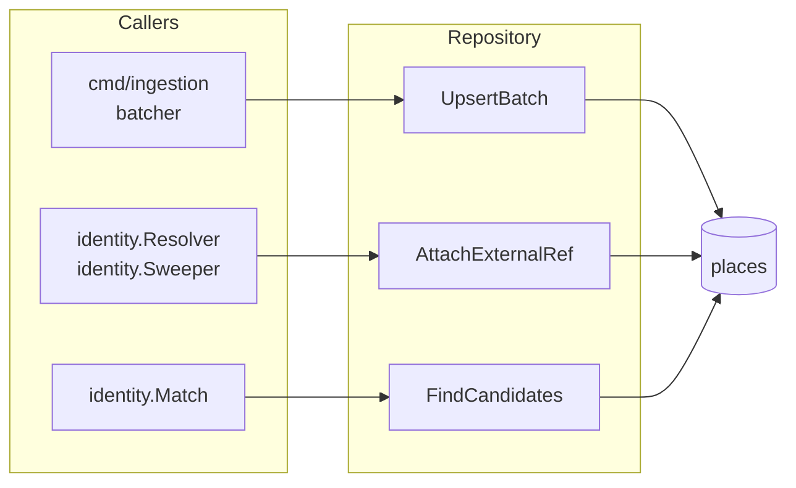

# internal/place

Data-access layer for the `places` table and the related `accessibility_profiles` table. The repository exposes the read and write operations the rest of the codebase needs against canonical places and their profiles — no business logic, no validation, no decisions about accessibility.

## What it provides

| Method | Used by | What it does |
|---|---|---|
| `UpsertBatch(ctx, places)` | the ingestion batcher | Bulk insert/update on `(osm_id, osm_type)` conflict. Uses `RETURNING id` so GORM back-populates the `ID` field on every place in the slice — the batcher harvests these as `touchedIDs` for the retry sweep. |
| `AttachExternalRef(ctx, placeID, source, ref)` | `identity.Resolver`, `identity.Sweeper` | Adds an `ExternalRef` to the place's `external_ids` JSONB map under the given source key, via Postgres `jsonb_set`. Concurrent attaches to different sources on the same place don't clobber each other. |
| `FindCandidates(ctx, lat, lng, radiusM, categories)` | `identity.Match` | Active places within `radiusM` of the point whose category is in `categories`. Uses `ST_DWithin` over a `geography(ST_Point(lng, lat))` expression. Backed by a PostGIS GIST index. |
| `UpsertProfile(ctx, placeID, profile)` | `cmd/api` (`PatchPlaceAccessibility`) | Create-or-update the accessibility profile for a place. Always overwrites — user-driven write path. Returns `created=true` when a new row was inserted. |
| `UpsertProfileIngestion(ctx, placeID, profile)` | ingestion batcher | Same as `UpsertProfile` but skips the write when `user_verified=true`, preserving human corrections across automated re-ingests. |

## Compile-time contracts

The repository asserts at compile time that it satisfies the matching package's interfaces:

- `identity.CandidateRepo`
- `identity.AttachRepo`

These are the seams that let the matcher stay I/O-free and let tests substitute fakes.

## Upsert semantics

The conflict key `(osm_id, osm_type)` is the natural identifier from OSM. Re-running an OSM ingest is safe: the same input maps to the same row, and `UpsertBatch` writes the latest values. Generated UUIDs in the `id` column are stable across upserts — that's why the batcher can collect them after the first write and hand them to the sweep on later runs.

The places table also stores `external_ids` as JSONB. `UpsertBatch` does not touch that column on conflict updates — it would otherwise overwrite Wheelmap-attached refs every time OSM ingest ran. `AttachExternalRef` is the only path that writes it.

## What it does not do

- Decide whether a place is accessible — that's the [a11y engine](../a11y).
- Validate input — that's [`internal/validation`](../validation).
- Decide whether an external record matches a place — that's [`internal/identity`](../identity).
- Talk to OSM, Wheelmap, or any upstream source.
