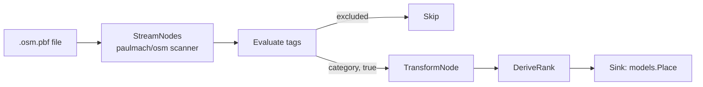

# internal/sources/osm

Canonical source for the place registry. Reads an OpenStreetMap `.osm.pbf` file, filters nodes whose tags qualify them as POIs, transforms each into a `models.Place`, and streams them to the batcher in `cmd/ingestion`. Declares `SourceKindCanonical` so the dispatcher routes it through the canonical pipeline.

## Pipeline

`StreamNodes` decodes the PBF and emits one OSM node at a time. Only matched POIs reach the sink.

## Tag filtering: allowlist by design

`Evaluate(tags)` decides inclusion. The POI universe in OSM is enormous; we want commerce, services, and public infrastructure with accessibility relevance — not every fence, bench, or tree. So the filter is an allowlist: unknown tags are excluded.

Resolution order inside `Evaluate`:

1. `amenity=*` mapped via `amenityToCategory` (food service, healthcare, education, finance, entertainment, government, transport, social, worship).
2. `public_transport=station` or `stop_area` → `CategoryTransport`.
3. `shop=*` (any value) → `CategoryShop`.
4. `building=*` plus any of `amenity / shop / tourism / leisure / office / healthcare / public_transport` → `CategoryOther` as a fallback so we don't lose buildings that look like POIs.

Anything else is dropped.

## Transformation

`TransformNode` builds a `models.Place` from an OSM node and a matched category. Coordinates come from the node; `Tags` is the full OSM tag map preserved as JSONB so `addr:street` and `addr:housenumber` (and anything else) remain available later — the identity matcher reads these tags directly when scoring address overlap.

The natural key for upserts is `(osm_id, osm_type)`, where `osm_type` is `node`, `way`, or `relation`. Today only nodes are streamed.

## Rank derivation

`DeriveRank` assigns one of three priorities based on category and tag context:

| Rank | Meaning | Examples |
|---|---|---|
| `RankLandmark` | Major city landmark or transit hub | airports, hospitals, universities, train stations |
| `RankEstablishment` | Standard commercial or public building | restaurants, shops, banks, cinemas |
| `RankFeature` | Minor utility feature | public toilets, ATMs |

Clients use the rank to prioritise results at low zoom levels — only landmarks at world view, establishments as you zoom in.

## Dependency

PBF decoding uses [`paulmach/osm`](https://github.com/paulmach/osm). The package wraps it just enough to stream nodes through `Sink` with a context for cancellation.
