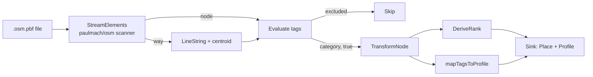

# internal/sources/osm

Canonical source for the place registry. Reads an OpenStreetMap `.osm.pbf` file, filters nodes and ways whose tags qualify them as POIs, transforms each into a `models.Place`, and streams them to the batcher in `cmd/ingestion`. Declares `SourceKindCanonical` so the dispatcher routes it through the canonical pipeline.

## Required preprocessing: annotated ways

Raw PBF ways only store node ID references, not coordinates. Computing a way's shape requires resolving those references against actual node locations, which this package does not do itself. The input `.osm.pbf` **must** be preprocessed with [`osmium-tool`](https://osmcode.org/osmium-tool/) before ingestion:

```
osmium add-locations-to-ways <extract>.pbf -o <extract>-annotated.pbf
```

`OSM_PBF_PATH` (see `cmd/ingestion/README.md`) must point at the annotated output. Ways whose nodes aren't annotated produce an empty resolved geometry and are skipped with a warning (see Error handling) — ingestion does not detect or work around a missing preprocessing step beyond that.

This is an additional flag on `osmium extract`, the step already required to scope a country/planet-wide extract down to a city or canton — not a new dependency.

## Pipeline


```mermaid
flowchart LR
  A[.osm.pbf file] --> B[StreamElements<br/>paulmach/osm scanner]
  B -- node --> C[Evaluate tags]
  B -- way --> W[LineString + centroid]
  W --> C
  C -- excluded --> D[Skip]
  C -- category, true --> E[TransformNode]
  E --> F[DeriveRank]
  E --> G[mapTagsToProfile]
  F --> H[Sink: Place + Profile]
  G --> H
```

`StreamElements` decodes the PBF and emits one OSM node or way at a time; relations are skipped. Only matched POIs reach the sink.

A way's representative `Lat`/`Lng` is the centroid (mean of coordinates) of its resolved `orb.LineString` — no polygon is persisted. Way-derived places are flat and independent, exactly like node-derived places: this package does not link a way (e.g. a mall) to the nodes inside it (e.g. its shops).

## Tag filtering: allowlist by design

`Evaluate(tags)` decides inclusion. The POI universe in OSM is enormous; we want commerce, services, and public infrastructure with accessibility relevance — not every fence, bench, or tree. So the filter is an allowlist: unknown tags are excluded.

Resolution order inside `Evaluate`:

1. `amenity=*` mapped via `amenityToCategory` (food service, healthcare, education, finance, entertainment, government, transport, social, worship).
2. `public_transport=station` or `stop_area` → `CategoryTransport`.
3. `shop=*` (any value) → `CategoryShop`.
4. `building=*` plus any of `amenity / shop / tourism / leisure / office / healthcare / public_transport` → `CategoryOther` as a fallback so we don't lose buildings that look like POIs.

Anything else is dropped.

## Transformation

`TransformNode` builds a `models.Place` from an OSM node and a matched category. Coordinates come from the node; `Tags` is the full OSM tag map preserved as JSONB so `addr:street` and `addr:housenumber` (and anything else) remain available later — the identity matcher reads these tags directly when scoring address overlap.

The natural key for upserts is `(osm_id, osm_type)`, where `osm_type` is `node`, `way`, or `relation`. Nodes and ways are streamed; relations (multipolygon buildings) are not handled.

## Accessibility tag mapping (v1)

`mapTagsToProfile` reads accessibility tags from the POI node and produces a `*models.AccessibilityProfile` or `nil`. POI-node only — no traversal to nearby `entrance=*` nodes or parent ways.

| Tag | Maps to |
|---|---|
| `wheelchair=yes\|designated\|limited\|no` | a `SourceReport{Source: "osm", Value: <raw tag value>}` — stored verbatim, not interpreted as a status |
| `toilets:wheelchair=yes\|no` | `RestroomProps.IsAccessible` |
| `capacity:disabled=N` | `ParkingProps.HasDisabledSpaces` (`N > 0`) + `Count` |
| `parking:disabled=no` | `ParkingProps.HasDisabledSpaces=false` |
| `automatic_door` not empty and ≠ `no` | `EntranceProps.Door.Type=automatic` |
| `step_count` or `entrance:step_count` ≥ 1 | `EntranceProps.IsLevel=false` |
| `ramp:wheelchair=yes\|no` | `EntranceProps.HasFixedRamp` (takes precedence over generic `ramp=no`) |
| `elevator=yes` | `ElevatorProps{}` (presence only; no dimensions from OSM) |

There is no conflict detection anywhere in this mapping or downstream. The `wheelchair` tag is never interpreted into a computed status — it is recorded as a raw opinion in `SourceReports` and left for clients to weigh alongside the typed component facts.

## Rank derivation

`DeriveRank` assigns one of three priorities based on category and tag context:

| Rank | Meaning | Examples |
|---|---|---|
| `RankLandmark` | Major city landmark or transit hub | airports, hospitals, universities, train stations |
| `RankEstablishment` | Standard commercial or public building | restaurants, shops, banks, cinemas |
| `RankFeature` | Minor utility feature | public toilets, ATMs |

Clients use the rank to prioritise results at low zoom levels — only landmarks at world view, establishments as you zoom in.

## Error handling

A way whose nodes aren't annotated (preprocessing step skipped, or the extract doesn't include all referenced nodes) produces an empty resolved `LineString`. `StreamElements` skips the way, logs a warning via `slog.Warn`, and does not fail the run.

## Dependency

PBF decoding uses [`paulmach/osm`](https://github.com/paulmach/osm); way geometry resolution uses its `paulmach/orb` dependency. The package wraps these just enough to stream nodes and ways through `Sink` with a context for cancellation.
