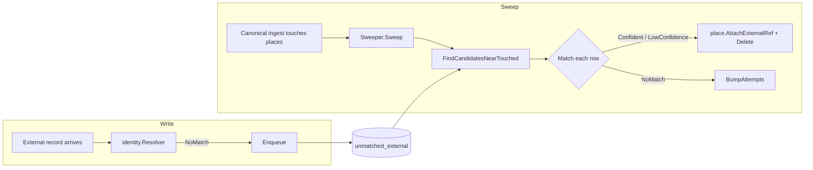

# internal/unmatched

Data-access layer for the `unmatched_external` table — the retry queue for external records (Wheelmap and similar) that the identity matcher could not attach to a canonical place when they first arrived. The repository implements both the enqueue side used by `identity.Resolver` and the read/update side used by `identity.Sweeper`.

## Why the queue exists

External sources see places the OSM ingest hasn't yet covered. Rather than drop those records, the resolver writes them here. After every canonical ingest finishes, the sweeper re-runs `Match` against the queue rows whose chances just improved — those near a place that was upserted in this run. Confident matches attach and the row is deleted; no-match bumps the attempt counter and leaves the row for next time.

## Schema

```sql
CREATE TABLE unmatched_external (
    id             BIGSERIAL                  PRIMARY KEY,
    source         TEXT                       NOT NULL,
    source_id      TEXT                       NOT NULL,
    name           TEXT                       NOT NULL DEFAULT '',
    category       TEXT                       NOT NULL DEFAULT '',
    street         TEXT                       NOT NULL DEFAULT '',
    housenumber    TEXT                       NOT NULL DEFAULT '',
    payload        JSONB                      NOT NULL,
    lat            DOUBLE PRECISION           NOT NULL,
    lng            DOUBLE PRECISION           NOT NULL,
    geom           GEOGRAPHY(POINT, 4326)     NOT NULL,
    last_attempted TIMESTAMPTZ                NOT NULL DEFAULT NOW(),
    attempts       INT                        NOT NULL DEFAULT 1,
    UNIQUE (source, source_id)
);

CREATE INDEX unmatched_external_geom_idx ON unmatched_external USING GIST (geom);
```

Notes:

- `name`, `category`, `street`, `housenumber` are denormalised matchable signal copied from the incoming `identity.Record`. The sweep reconstructs a `Record` from these columns directly — no upstream payload unmarshalling required.
- `payload` is the raw upstream JSON, kept verbatim so we can replay older queue rows through future matcher improvements if needed.
- `(source, source_id)` is the natural key. Re-enqueueing the same upstream record bumps `attempts` and refreshes the matchable fields and coordinates.
- The `geom` GIST index is what makes `FindCandidatesNearTouched` cheap as the table grows.

## Methods

| Method | Used by | What it does |
|---|---|---|
| `Enqueue(ctx, u)` | `identity.Resolver` (NoMatch branch) | `INSERT … ON CONFLICT (source, source_id) DO UPDATE` — bumps `attempts`, refreshes everything else from the new write. |
| `FindCandidatesNearTouched(ctx, touchedIDs, radiusM)` | `identity.Sweeper` | Set-based `JOIN` of queue rows against the IDs of just-touched places via `ST_DWithin`. Returns `DISTINCT` rows so a queue row near several touched places appears once. |
| `BumpAttempts(ctx, queueID, lastAttempted)` | `identity.Sweeper` (NoMatch outcome) | Increments `attempts` and refreshes `last_attempted` for the row. Returns an error if the row disappeared concurrently. |
| `Delete(ctx, queueID)` | `identity.Sweeper` (Confident / LowConfidence outcome, after successful attach) | Removes the row. Errors if the row disappeared concurrently. |

## Flow



## Compile-time contracts

The repository asserts at compile time that it satisfies the matching package's interfaces:

- `identity.EnqueueRepo`
- `identity.SweepRepo`

These are the seams the matcher uses for storage, and they keep `internal/identity` I/O-free.
