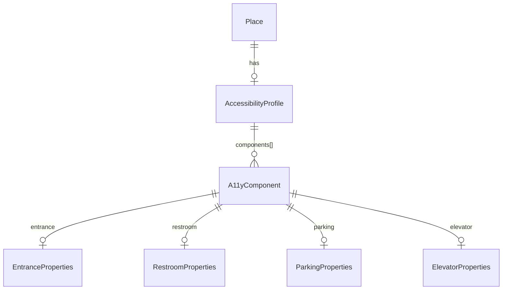

# pkg/models

Domain types shared across the `cmd/api` and `cmd/ingestion` binaries. This package is the boundary between the persistence shape and the API shape: the same structs are written to and read from Postgres (via GORM tags) and serialised as JSON in API responses (via `json` tags). No service logic lives here.

## Place hierarchy

`Place` is the core entity. A place can reference a parent via `ParentID` (a UUID foreign key). The hierarchy is shallow by design — one level is enough to model a shop inside a mall, or a gate inside an airport. The parent relationship is used at read time by `internal/a11y` to compute an effective accessibility profile that inherits parent components the child doesn't own.

`Rank` (`RankLandmark`, `RankEstablishment`, `RankFeature`) controls display priority at different map zoom levels. It is set by the ingestion pipeline and ignored by the API on writes.

`PlaceStatus` (`active`, `closed`, `osm_removed`) tracks the lifecycle of OSM-sourced records. `osm_removed` allows user-submitted accessibility data to survive the OSM deletion of its backing node.

## Accessibility model



`AccessibilityProfile` carries a top-level `OverallStatus` (client-submitted) and an array of typed `A11yComponent` entries. Each component has its own `OverallStatus`, a type discriminator (`entrance`, `restroom`, `parking`, `elevator`, `other`), and a typed properties pointer for that discriminator. Only the matching properties pointer is populated per component — the others are omitted from JSON.

`AuditFlags` on each component are string facts computed by `internal/a11y` on every write. They describe physical properties of the component (e.g. `"narrow width (0.8m required)"`, `"step with no ramp"`). They are stored as facts and surfaced to clients as-is. The API never uses them to decide a place's accessibility status — that is left to client logic applied against the user's profile.

`IsInherited` and `SourceID` on a component are set at read time by `internal/a11y.ComputeEffectiveProfile` when the component originates from a parent place. They are not persisted.

`UserVerified` on `AccessibilityProfile` signals that the data was submitted by a human via the API. The ingestion pipeline will not overwrite a profile where this flag is true.

## External references

`ExternalIDs` is a JSONB map from source name to `ExternalRef`. It allows a place to carry provenance links to external systems without schema changes per source. The OSM entry uses `confidence: 1.0` (canonical). Non-OSM sources carry a match confidence in `[0, 1]` and a `MatchedAt` timestamp.

Example stored value:

```json
{
  "osm": {"id": "node/123456", "confidence": 1.0},
  "wheelmap": {"id": "42", "confidence": 0.91, "matched_at": "2026-01-15T10:00:00Z"}
}
```

## UnmatchedExternal

`UnmatchedExternal` is a queue row for non-OSM records that the identity resolver could not attach to a known place. The row stores the matchable signal fields (`Name`, `Category`, `Street`, `HouseNumber`, `Lat`, `Lng`) alongside the full raw `Payload`. After each OSM ingest sweep, a retry pass calls `Match` again on queued rows for the affected region using these signal fields — without needing to re-fetch the original source payload.

## JSONB custom types

`Geometry`, `PlaceTags`, `A11yComponents`, and `ExternalIDs` all implement `driver.Valuer` / `sql.Scanner`. GORM maps them to `type:jsonb` columns. The scanner always initialises a non-nil value on read so callers don't need to nil-check the container before ranging.

## APIKey

`APIKey` stores the hashed credential (`key_hash`, SHA-256 hex) and the registrant email. The raw key is never persisted; it is returned once at registration and discarded. `RevokedAt` is a nullable timestamp — a nil value means the key is active.
