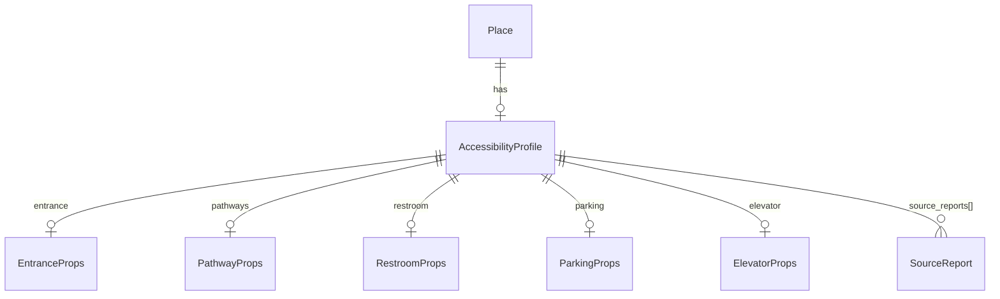

# pkg/models

Domain types shared across the `cmd/api` and `cmd/ingestion` binaries. This package is the boundary between the persistence shape and the API shape: the same structs are written to and read from Postgres (via GORM tags) and serialised as JSON in API responses (via `json` tags). No service logic lives here.

## Place hierarchy

`Place` is the core entity. A place can reference a parent via `ParentID` (a UUID foreign key). The hierarchy is shallow by design — one level is enough to model a shop inside a mall, or a gate inside an airport. The parent relationship is used at read time by `internal/a11y` to compute an effective accessibility profile that inherits parent components the child doesn't own.

`Rank` (`RankLandmark`, `RankEstablishment`, `RankFeature`) controls display priority at different map zoom levels. It is set by the ingestion pipeline and ignored by the API on writes.

`PlaceStatus` (`active`, `closed`, `osm_removed`) tracks the lifecycle of OSM-sourced records. `osm_removed` allows user-submitted accessibility data to survive the OSM deletion of its backing node.

## Accessibility model


```mermaid
erDiagram
    Place ||--o| AccessibilityProfile : "has"
    AccessibilityProfile ||--o| EntranceProps : "entrance"
    AccessibilityProfile ||--o| PathwayProps : "pathways"
    AccessibilityProfile ||--o| RestroomProps : "restroom"
    AccessibilityProfile ||--o| ParkingProps : "parking"
    AccessibilityProfile ||--o| ElevatorProps : "elevator"
    AccessibilityProfile ||--o{ SourceReport : "source_reports[]"
```

`AccessibilityProfile` has one named, independently-optional field per component type — `Entrance`, `Pathways`, `Restroom`, `Parking`, `Elevator` — rather than an array of generically-typed components. Each is a pointer; a `nil` component means no data was submitted for it, not "unknown/inaccessible." There is no top-level or per-component status field — component structs hold typed facts directly (e.g. `EntranceProps.Width`, `RestroomProps.HasGrabRails`).

`SourceReports` is a separate array of `SourceReport{Source, Value, RecordedAt}` — raw opinions from external sources (e.g. OSM's `wheelchair=yes` tag) stored verbatim, uninterpreted. Clients decide how much to trust each source.

`AuditFlags` on each component are string facts computed by `internal/a11y` on every write (e.g. `"narrow width (0.8m required)"`). They describe physical properties of that component and are surfaced to clients as-is. The API never uses them to decide a place's accessibility status, and no write is ever rejected because of them — that judgment is left to client logic applied against the user's profile.

`IsInherited` and `SourceID` on a component are set at read time by `internal/a11y.ComputeEffectiveProfile` when the component originates from a parent place. They are not persisted.

`UserVerified` on `AccessibilityProfile` is intended to signal that the data was submitted by a human via the API, and gates the ingestion pipeline (`UpsertProfileIngestion` skips a profile entirely when this is `true`, preserving human corrections). The OpenAPI spec marks it `readOnly` (server-controlled, not client-writable), and no handler in `cmd/api` ever assigns it — so in practice every profile is `false` today.

## External references

`ExternalIDs` is a JSONB map from source name to `ExternalRef`. It allows a place to carry provenance links to external systems without schema changes per source. The OSM entry uses `confidence: 1.0` (canonical). Non-OSM sources carry a match confidence in `[0, 1]` and a `MatchedAt` timestamp.

Example stored value:

```json
{
  "osm": {"id": "node/123456", "confidence": 1.0},
  "wheelmap": {"id": "42", "confidence": 0.91, "matched_at": "2026-01-15T10:00:00Z"}
}
```

## UnmatchedExternal

`UnmatchedExternal` is a queue row for non-OSM records that the identity resolver could not attach to a known place. The row stores the matchable signal fields (`Name`, `Category`, `Street`, `HouseNumber`, `Lat`, `Lng`) alongside the full raw `Payload`. After each OSM ingest sweep, a retry pass calls `Match` again on queued rows for the affected region using these signal fields — without needing to re-fetch the original source payload.

## JSONB custom types

`Geometry`, `PlaceTags`, `ExternalIDs`, `SourceReports`, and each component props type (`EntranceProps`, `PathwayProps`, `RestroomProps`, `ParkingProps`, `ElevatorProps`) implement `driver.Valuer` / `sql.Scanner`. GORM maps them to `type:jsonb` columns.

## APIKey

`APIKey` stores the hashed credential (`key_hash`, SHA-256 hex) and the registrant email. The raw key is never persisted; it is returned once at registration and discarded. `RevokedAt` is a nullable timestamp — a nil value means the key is active.
